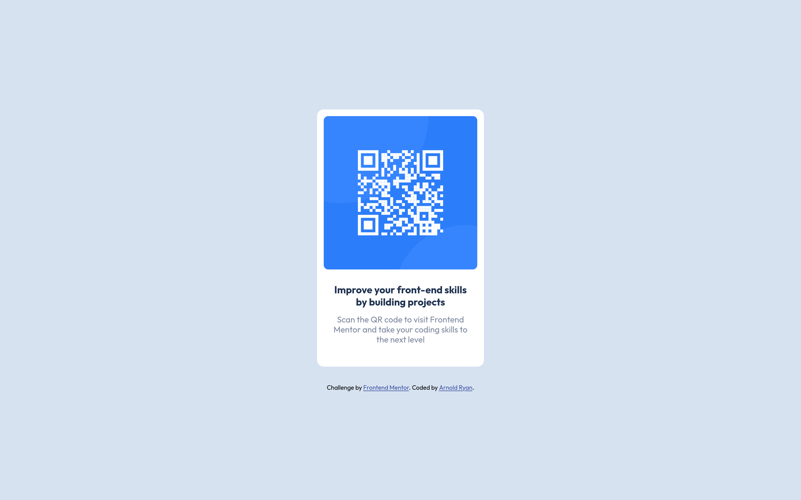

# Frontend Mentor - QR code component solution

This is a solution to the [QR code component challenge on Frontend Mentor](https://www.frontendmentor.io/challenges/qr-code-component-iux_sIO_H).

## Table of contents

- [Overview](#overview)
  - [Screenshot](#screenshot)
  - [Links](#links)
- [My process](#my-process)
  - [Built with](#built-with)
  - [What I learned](#what-i-learned)
- [Author](#author)

## Overview

### Screenshot

### Links

- Solution URL: [Github Code](https://github.com/arnold-ryan/qr-code-component-main)
- Live Site URL: [Lives Site](https://arnold-qr-code-card.netlify.app/)

## My process

### Built with

- Semantic HTML5 markup
- CSS custom properties

### What I learned

- Fitting images in containers

## Author

- Website - [Arnold Odhiambo](https://arnold-portfolio.netlify.app)
- Frontend Mentor - [@arnold-ryan](https://www.frontendmentor.io/profile/arnold-ryan
- LinkedIn - [Arnold Odhiambo](https://www.linkedin.com/in/arnold-odhiambo-dev/)
